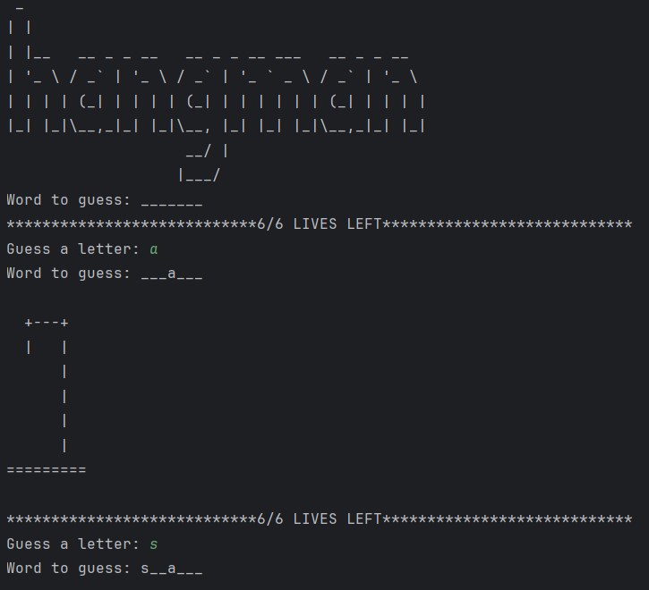
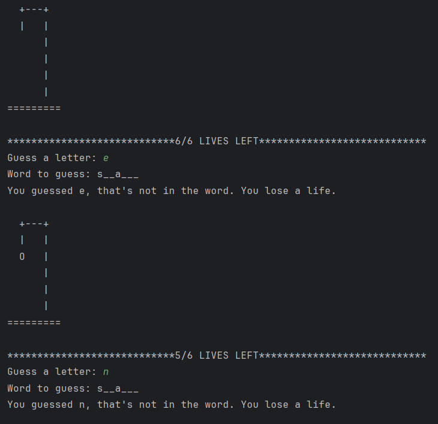
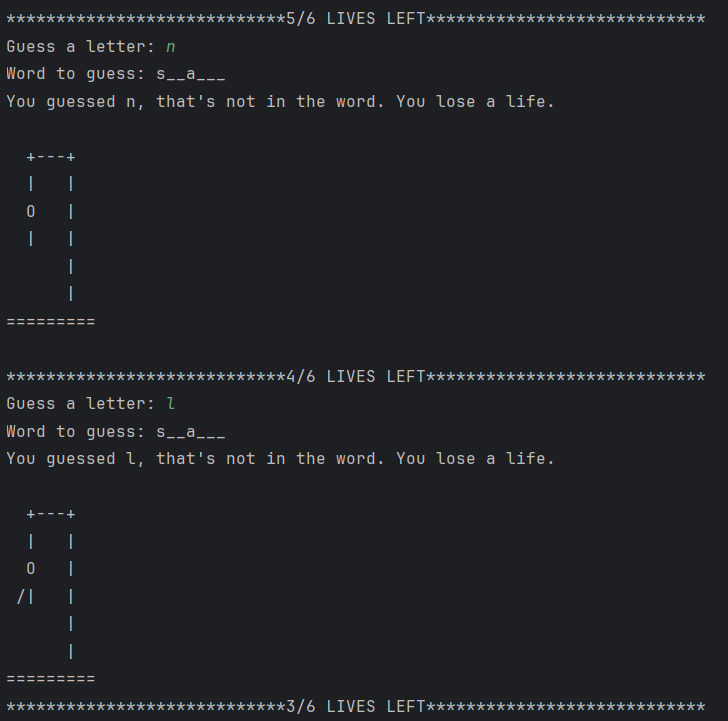
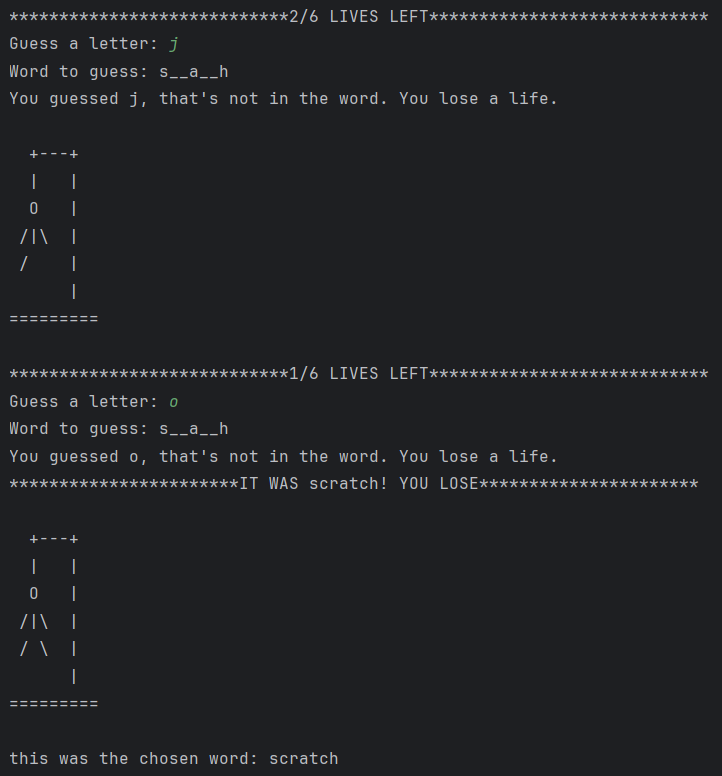
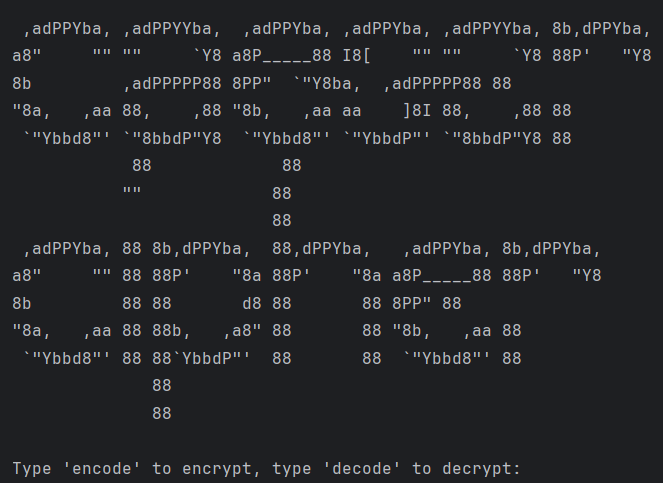
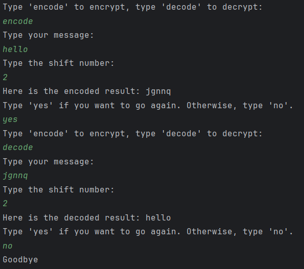
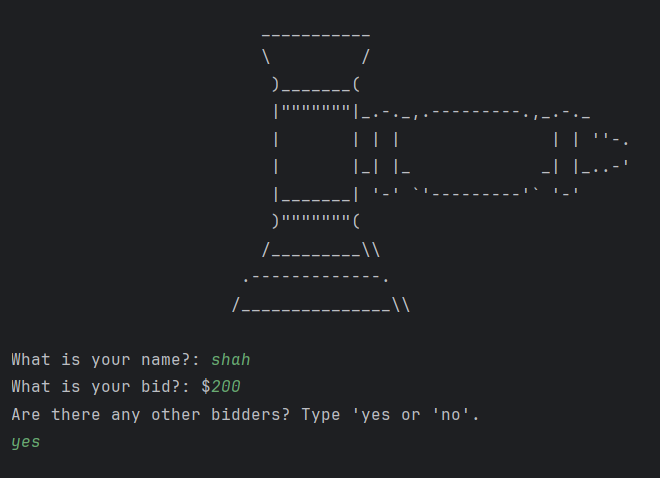
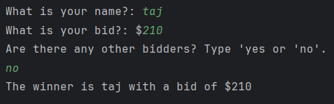

# Python Scripting Practice 🐍

Python scripts demonstrating core programming fundamentals: input handling, math, strings, and functions. Building blocks for AWS automation and DevOps scripting.

## Featured Projects

### Table of Contents
- [1. Tip Calculator](#1--tip-calculator)
- [2. Rollercoaster Tickets](#2--rollercoaster-tickets)
- [3. Treasure Island](#3-treasure-island)
- [4. Heads or Tails](#4--heads-or-tails)
- [5. Rock Paper Scissors](#5-rock-paper-scissors)
- [6. Password Generator](#6--password-generator)
- [7. Hangman](#7--hangman)
- [8. Caesar Cipher](#8--caesar-cipher)
- [9. Blind auction](#9-blind-auction)

### 1. 📱 Tip Calculator
Interactive tool to split bills with custom tip percentage.

**Skills Demonstrated:**
- User input (`input()`)
- Type conversion (`float()`, `int()`)
- F-string formatting
- Rounding (`round()`)

**Demo:**

[View Code](tip_calculator.py)

### 2. 🎢 Rollercoaster Tickets
Nested conditional pricing based on height/age/photo.

**Skills Demonstrated:**
- Nested if/elif chains
- Multiple conditions (`>=`, `<=`)
- String methods (`.upper()`)
- Dynamic billing logic

**Demo:**

[View Code](rollercoaster_ticket.py)

### 3. Treasure Island
Interactive text adventure with branching story.

**Skills Demonstrated:**
- Deep nested if/elif (3 levels)
- Multiline strings (ASCII art)
- String methods (`.lower()`)

**Demo:**

[View Code](treasure_island.py)

### 4. 🎲 Heads or Tails
50/50 coin flip simulator using random module.

**Skills Demonstrated:**
- Random integers (`random.randint()`)
- Simple if/else logic
- Single-line conditional execution

**Demo:**

[View Code](Heads_or_tails.py)

### 5. Rock Paper Scissors
Classic 2-player ASCII art game with input validation and win/loss logic.

**Skills Demonstrated:**
- ASCII multiline strings
- List indexing (`game_images[user_choice]`)
- Input validation (`if user_choice < 0 or user_choice > 2`)
- Complex conditional logic (win/lose/draw)
- Random computer opponent (`random.randint(0, 2)`)

**Demo:**

[View Code](rock_paper_scissors.py)

### 6. 🔐 Password Generator
Interactive CLI tool that generates secure, customizable passwords via random character selection and shuffling.

**Skills Demonstrated:**
- User input parsing (`int(input())`)
- Nested loops (`range()` + `random.choice()`)
- List building (`append()`)
- In-place shuffling (`random.shuffle()`)
- String concatenation (`"".join()`)

**Demo:**

[View Code](Password_generator.py)

### 7. 🎮 Hangman
Single-player word guessing game with 6 lives, random words, and ASCII stages.

**Skills Demonstrated:**
- Random word choice (`random.choice()`)
- Blanks display (`"_".join()`)
- Lives counter (`lives -= 1`)
- Repeated guesses (`while "_" in display`)
- ASCII stages (`stages[lives]`)

**Demo:**

This continues until we either guess the word or lose the game.

[View Code](Hangman/Hangman.py)

### 8. 🔤 Caesar Cipher
Infinite replay text encoder/decoder using single function with negative shift trick.

**Skills Demonstrated:**
- Single caesar() for encode/decode (`shift_amount *= -1`)
- Modulo wrapping (`shifted_position %= len(alphabet)`)
- Infinite loop (`while should_continue`)
- Boolean flag control (`should_continue = False`)
- Non-alphabet preservation (`if letter not in alphabet`)

**Demo:**

[View Code](Caesar_cipher/caesar_cipher.py)

### 9. Blind auction

Secret bidding game—highest hidden bid wins!

**Skills Demonstrated:**
- While loops for continuous input.
- Dictionaries (`{name: bid}`)
- Custom functions (`find_highest_bidder()`)
- f-string winner announcement.
- User validation (yes/no continue)

**Demo:**

[View Code](Blind_auction.py)

[⬆ Back to Top](#table-of-contents)
​

## Quick Start
1. Clone: `git clone https://github.com/shahtaj2102/python-scripting-practice.git`
2. Run: `python rollercoaster_ticket.py` , `python tip_calculator.py` , `python Treasure_island.py` , `python Heads_or_tails.py` , `python rock_paper_scissors.py` , `python Password_generator.py` ,
        `python Hangman.py` , `python caesar_cipher.py` , `python Blind_auction.py`

## About
**Shahtaj Singh Gill** – AWS Cloud Engineer, Toronto.

[Portfolio](https://github.com/shahtaj2102) | [LinkedIn](https://www.linkedin.com/in/shahtaj-aws-sap-toronto)
